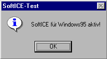
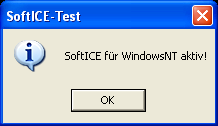

# Entry Information:

## DRML Entry Name:

**Copy-X**

***

## Authors/Contributors:

* HeroponRikiBestest - Entry author
* TheRogueArchivist - Reviewer

***

## Table of Contents:

* [Entry Information](#entry-information) ([Alt.](#Entry%20Information))
	* [DRML Entry Name](#drml-entry-name) ([Alt.](#DRML%20Entry%20Name))
	* [Authors/Contributors](#authorscontributors)
	* [Table of Contents](#table-of-contents) ([Alt.](#Table%20of%20Contents))
	* [Categories](#categories)
	* [DRML Entry Version](#drml-entry-version) ([Alt.](#DRML%20Entry%20Version))
* [DRM Information](#drm-information) ([Alt.](#DRM%20Information))
	* [Names](#names)
	* [Developers](#developers)
	* [Protection Features](#protection-features) ([Alt.](#Protection%20Features))
	* [Overall Description](#overall-description) ([Alt.](#Overall%20Description))
	* [Timeline](#timeline)
	* [Versions & Differences](#versions--differences) ([Alt.](#Versions%20&%20Differences))
		* [Tested](#tested)
		* [Untested](#untested)
	* [Samples](#samples)
		* [Confirmed](#confirmed)
		* [Unconfirmed](#unconfirmed)
	* [Supported Platforms](#supported-platforms) ([Alt.](#Supported%20Platforms))
	* [Software Known to Detect](#software-known-to-detect) ([Alt.](#Software%20Known%20to%20Detect))
	* [Preservation Instructions](#preservation-instructions) ([Alt.](#Preservation%20Instructions))
	* [Associated File Attributes](#associated-file-attributes) ([Alt.](#Associated%20File%20Attributes))
	* [Known Manufacturing Information](#known-manufacturing-information) ([Alt.](#Known%20Manufacturing%20Information))
		* [Known Manufacturing Plants](#known-manufacturing-plants) ([Alt.](#Known%20Manufacturing%20Plants))
		* [Known Ringcode Information](#known-ringcode-information) ([Alt.](#Known%20Ringcode%20Information))
			* [Mastering Code](#mastering-code)  ([Alt.](#Mastering%20Code))
			* [Mastering SID Code](#mastering-sid-code)  ([Alt.](#Mastering%20SID%20Code))
			* [Toolstamp or Mastering Code](#toolstamp-or-mastering-code)  ([Alt.](#Toolstamp%20or%20Mastering%20Code))
			* [Mould SID Code](#mould-sid-code)  ([Alt.](#Mould%20SID%20Code))
* [Reference Material](#reference-material) ([Alt.](#Reference%20Material))
	* [Media](#media)
	* [Additional Resources](#additional-resources) ([Alt.](#Additional%20Resources))
	* [Footnotes](#footnotes)

*** 

## Categories: 

* Optical Copy Protection

***

## Protection Features:

* Ring protection[^Check_Versions_Light]
* Dummy files[^Check_Versions_Light]
* Disc check[^Check_Versions_Professional]
* SoftICE Debugger Protection[^Check_Versions_Professional]

[^Check_Versions_Light]: Please see the entry for "copy-X light" in "Versions & Differences" section.
[^Check_Versions_Professional]: Please see the entry for "copy-X professional" in "Versions & Differences" section.

***

## DRML Entry Version: 

***

# DRM Information:

## Names: 

* copy-X[^CopyX_Original_Website]
* copy-X - the ultimate Copy-Killer.[^CopyX_Original_Website]
* copy-X audio[^CopyX_Original_Website]
* copy-X light[^CopyX_Original_Website]
* copy-X professional[^CopyX_Original_Website]
* copy-X trial maker[^CopyX_Original_Website]

[^CopyX_Original_Website]: [The original optimal media link for copy-X.](https://web.archive.org/web/20011016234742/http://www.optimal-online.de:80/product/copy_x.htm)

***

## Developers:

* optimal media production[^CopyX_Original_Website] (Until 2011)[^Discogs_Optimal_Page]
* optimal media[^CopyX_Current_Website] (Current)

[^Discogs_Optimal_Page]: [Discogs page for optimal media](https://www.discogs.com/label/313190-Optimal-Media-GmbH)

[^CopyX_Current_Website]: [The current optimal media website link.](https://web.archive.org/web/20241003002305/https://www.optimal-media.com/)

***

## Overall Description:

Ring protection copy protection scheme from german company optimal media[^CopyX_Original_Website]. As seen in Names, four different types seem to have been in use[^CopyX_Original_Website]. Note that it has not yet been confirmed whether light and professional correspond to the currently established distinct behaviors, but it seems to be the most likely conclusion.
Had to be mastered at a specific optimal media production plant[^CopyX_2009_Document].

[^CopyX_2009_Document]: [Optimal media document from 2009, seemingly for prospective customers.](https://web.archive.org/web/20220322025111/http://press9.de/fileadmin/user_upload/PDF/copy_protection_july_09.pdf)

***

## Timeline: 

#### 2000s

* 2001?: Seems to come into existence about here[^CopyX_Original_Website].

* 2009: Some sort of overhaul[^CopyX_2009_Document] of copy-X occurs.

***

## Versions & Differences: 

#### Tested:

* copy-X light[^84759][^107929][^81628][^Kenny][^101786]
* copy-X professional[^108150][^48393][^82475][^DE_EM2DX][^Petterson]

[^84759]: [Black Cats and Pointed Hats (USA) (En,De)](http://redump.org/disc/84759/)
[^107929]: [Robinson Crusoe (USA)](http://redump.org/disc/107929/)
[^81628]: [Webmaster (USA))](http://redump.org/disc/81628/)
[^108150]: [Case for TKKG, A - The Mystery of the Mayan Treasure (USA) (En,De)](http://redump.org/disc/108150/)
[^48393]: [Emergency 4 - Global Fighters for Life (Germany) (Disc 1)](http://redump.org/disc/48393/)
[^82475]: [Sluzhba 911 (Russia) - Remnants](http://redump.org/disc/82475/)
[^DE_EM2DX]: [German Emergency 2 Deluxe](waiting on null to upload/)
[^Petterson]: [Petterson und Findus - Hühnertanz und Katerzirkus](waiting on null to upload)
[^Kenny]: [Kenny's Adventure](waiting on null to upload)
[^101786]: [Max and the Magician (Europe) (En,Fr,De,Es)](http://redump.org/disc/101786/)

##### copy-X light:

This behavior has been tested, but it is still unconfirmed if it specifically corresponds to copy-X light. 
Basic ring protection via dummy files intersected by rings. No software protection is used unless otherwise supplied by the game itself. Can be circumvented by simply not copying the dummy files when copying the rest of the game from the disc.

##### copy-X professional:

This behavior has been tested, but it is still unconfirmed if it specifically corresponds to copy-X professional.
Builds upon copy-X light. Contains everything described there, but also adds software protection in the form of a disc check, which appears to additionally check one of the dummy files. Copy-X professional also checks if the kernel debugging software SoftICE is active via a process called SoftICE-Test, checking both for "SoftICE for Windows 95" and for "SoftICE for Windows NT", ending game execution if detected when booting the game. This seems to be the only debugger protected against, likely due to the popularity of this debugger at the time.

#### Untested:

* copy-X audio[^D_8232013][^D_1436646][^D_2182905][^D_451419]
* copy-X trial maker

##### copy-X audio:

No samples have been tested at the moment, so exact specifics cannot be confirmed. Used to protect Audio CDs.

##### copy-X trial maker:

No samples currently known, and thus no information either.

***

## Samples:
 
#### Confirmed:

* copy-X light[^84759][^107929][^81628][^Kenny][^101786]
* copy-X professional[^108150][^48393][^82475][^DE_EM2DX][^Petterson]

#### Unconfirmed: 

* copy-X audio[^D_8232013][^D_1436646][^D_2182905][^D_451419]
* German Westerner 2[^pcgames_de_westerner2][^gamestar_de_westerner2]
* Many games from Sixteen Tons Entertainment
* Many games from Tivola
* Many games from Terzio
* Many pieces of software from Magix 

[^D_8232013]: [Die Wilden Kerle – DWK4 - Der Angriff Der Silberlichten (Das Hörspiel Zum Kinofilm)](https://www.discogs.com/release/8232013-Die-Wilden-Kerle-DWK4-Der-Angriff-Der-Silberlichten-Das-H%C3%B6rspiel-Zum-Kinofilm)
[^D_1436646]: [Laava – Wherever You Are (I Feel Love)](https://www.discogs.com/release/1436646-Laava-Wherever-You-Are-I-Feel-Love)
[^D_2182905]: [Manfred Mann* – 2006](https://www.discogs.com/release/2182905-Manfred-Mann-2006)
[^D_451419]: [De-Phazz – Godsdog](https://www.discogs.com/release/451419-De-Phazz-Godsdog)
[^pcgames_de_westerner2]: [The Westerner 2 im PC-Games-Test: "Ein enttäuschendes Adventure ... " ](https://web.archive.org/web/20090322110537/http://www.pcgames.de/aid,679282/The-Westerner-2-im-PC-Games-Test-Ein-enttaeuschendes-Adventure-/PC/Test/)
[^gamestar_de_westerner2]: ["The Westerner 2" (gamestar.de Publication) (Archive pending)](https://download.gamestar.de/public/43400/43452/05_2009_096.pdf)

***

## Supported Platforms:

* copy-X light: Any (no software protection is employed, although it appears to mainly be marketed for Windows games regardless.)

* copy-X professional: Windows
(Some professional games are Hybrid PC/Mac discs, but the Mac versions of these games do not appear to utilize any sort of software protection.)[^108150]

* copy-X audio: Audio CD

***

## Software Known to Detect:

Note: While ProtectionID does detect copy-X, it detects it as "Optgraph Copy-X / Ring-Protech". As far as current research has found, there is no relation between copy-X and Ring Protech other than both being ring-based protections, and the optgraph file in question is not found on Ring Protech. PiD is thus believed to be incorrect in designating it also Ring-Protech, and it's just detecting Copy-X in these instances.

* ProtectionID[^PiD_List]
* BinaryObjectScanner[^BoS_File]

[^BoS_File]: [BinaryObjectScanner code file in charge of detecting Copy-X](https://github.com/SabreTools/BinaryObjectScanner/blob/master/BinaryObjectScanner/Protection/CopyX.cs)

[^PiD_List]: [Old PiD website link listing PC ISO protections](https://web.archive.org/web/20090830061942/http://pid.gamecopyworld.com/)

***

## Preservation Instructions:

The ring protection present on all copy-X discs will cause errors during dumping. This will not cause issues with the playability of the final image, but may make it difficult or slow to copy/rip data, and makes it very difficult to guarantee you've gotten a 1:1 rip of all data on the disc.

copy-X light: None. Copying all files from the disc besides the dummy data directory is sufficient to defeat the protection.

copy-X professional: Any sort of basic copy of the disc image appears to work. An ISO of the game will function, as will Bin/Cue or other similar formats if the game has audio tracks.

*** 

## Associated File Attributes:

### File Directories:

#### "System":
Directory for dummy files used by most professional[^48393][^DE_EM2DX] discs so far, as well as some light[^Kenny] discs.

#### "ZDAT"/"zdata":
ZDAT is the directory for dummy files used by some[^84759][^107929][^81628][^101786], but not all[^Kenny] light discs, and two known professional[^Petterson] disc so far. One calls it zdata[^108150], one calls it ZDATA[^108150], and one uses System[^Kenny] instead. Further variance likely.

### File Names:

Note: file names are not case sensitive, and vary from disc to disc.

#### "[m/g]ov_*.x64":
Dummy file associated with professional. Names include gov_io.x64[^108150][^Petterson], gov_05.x64[^48393][^DE_EM2DX], and mov_io.x64.

#### "iofile.x64"[^48393][^DE_EM2DX][^108150][^Petterson]:
Dummy file associated with professional. Seems to be directly referenced by optgraph.dll.

#### "sound.x64"[^48393][^108150][^Petterson]:
Dummy file associated with professional. Seemingly not present on at least one[^DE_EM2DX] professional disc.

#### "optgraph.dll"[^DE_EM2DX][^48393][^108150][^Petterson]:
Dll file responsible for software protection on professional discs.

***

## Known Manufacturing Information:

### Known Manufacturing Plants:

* `optimal media production`

### Known Ringcode Information:

#### Mastering Code:

Note: Tivola discs add "Tivola    MM/[last 2 digits of year]" in between "manufactured by optimal media production" and "A######-0[Disc Number]", but otherwise follow that format.

* `manufactured by optimal media production    A######-0[Disc Number]`[^108150] (The majority of known samples have this mastering code. Only the ones that don't are listed below.)
* `OH! Datenservice GmbH   www.oh-datenservice.de    A######-0[Disc Number]`[^48393][^DE_EM2DX] (Seemingly mainly used by Sixteen Tons Entertainment)
* `KIDDINX    A######-0[Disc Number][^Petterson]

#### Mastering SID Code:

* `IFPI L571`(Every known sample)

#### Toolstamp or Mastering Code:

* N/A

#### Mould SID Code:

*  `IFPI 97xx`(Every known sample)

***

# Reference Material:

## Media: 

1. 'SoftICE for Windows 95' being detected[^108150]:  

2. 'SoftICE for Windows NT' being detected[^108150]:  

***

## Additional Resources:

### Official Resources:

* [The original optimal media link for copy-X.](https://web.archive.org/web/20011016234742/http://www.optimal-online.de:80/product/copy_x.htm)

* [Optimal media document from 2009, seemingly for prospective customers.](http://press9.de/fileadmin/user_upload/PDF/copy_protection_july_09.pdf)

***

### Footnotes:

