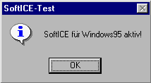
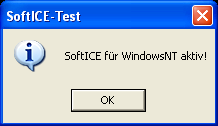

# Entry Information:

## DRML Entry Name:

**Copy-X**

***

## Authors/Contributors:

* HeroponRikiBestest - Entry author
* gig3x - Background information, leads, and research allowing for the creation of this article
* TheRogueArchivist - Reviewer

***

## Table of Contents:

* [Entry Information](#entry-information) ([Alt.](#Entry%20Information))
	* [DRML Entry Name](#drml-entry-name) ([Alt.](#DRML%20Entry%20Name))
	* [Authors/Contributors](#authorscontributors)
	* [Table of Contents](#table-of-contents) ([Alt.](#Table%20of%20Contents))
	* [Categories](#categories)
	* [DRML Entry Version](#drml-entry-version) ([Alt.](#DRML%20Entry%20Version))
* [DRM Information](#drm-information) ([Alt.](#DRM%20Information))
	* [Names](#names)
	* [Developers](#developers)
	* [Protection Features](#protection-features) ([Alt.](#Protection%20Features))
	* [Overall Description](#overall-description) ([Alt.](#Overall%20Description))
	* [Timeline](#timeline)
	* [Versions & Differences](#versions--differences) ([Alt.](#Versions%20&%20Differences))
		* [Tested](#tested)
		* [Untested](#untested)
	* [Samples](#samples)
		* [Confirmed](#confirmed)
		* [Unconfirmed](#unconfirmed)
	* [Supported Platforms](#supported-platforms) ([Alt.](#Supported%20Platforms))
	* [Software Known to Detect](#software-known-to-detect) ([Alt.](#Software%20Known%20to%20Detect))
	* [Preservation Instructions](#preservation-instructions) ([Alt.](#Preservation%20Instructions))
	* [Associated File Attributes](#associated-file-attributes) ([Alt.](#Associated%20File%20Attributes))
	* [Known Manufacturing Information](#known-manufacturing-information) ([Alt.](#Known%20Manufacturing%20Information))
		* [Known Manufacturing Plants](#known-manufacturing-plants) ([Alt.](#Known%20Manufacturing%20Plants))
		* [Known Ringcode Information](#known-ringcode-information) ([Alt.](#Known%20Ringcode%20Information))
			* [Mastering Code](#mastering-code)  ([Alt.](#Mastering%20Code))
			* [Mastering SID Code](#mastering-sid-code)  ([Alt.](#Mastering%20SID%20Code))
			* [Toolstamp or Mastering Code](#toolstamp-or-mastering-code)  ([Alt.](#Toolstamp%20or%20Mastering%20Code))
			* [Mould SID Code](#mould-sid-code)  ([Alt.](#Mould%20SID%20Code))
* [Reference Material](#reference-material) ([Alt.](#Reference%20Material))
	* [Media](#media)
	* [Additional Resources](#additional-resources) ([Alt.](#Additional%20Resources))
	* [Footnotes](#footnotes)

*** 

## Categories: 

* Optical Copy Protection

***

## Protection Features:

* Ring protection[^Check_Versions_Light]
* Dummy files[^Check_Versions_Light]
* Disc check[^Check_Versions_Professional]
* SoftICE Debugger Protection[^Check_Versions_Professional]

[^Check_Versions_Light]: Please see the entry for "copy-X light" in "Versions & Differences" section.
[^Check_Versions_Professional]: Please see the entry for "copy-X professional" in "Versions & Differences" section.

***

## DRML Entry Version: 

***

# DRM Information:

## Names: 

* copy-X[^CopyX_Original_Website]
* copy-X - the ultimate Copy-Killer.[^CopyX_Original_Website]
* copy-X audio[^CopyX_Original_Website]
* copy-X light[^CopyX_Original_Website]
* copy-X professional[^CopyX_Original_Website]
* copy-X trial maker[^CopyX_Original_Website]

[^CopyX_Original_Website]: [First known description of copy-X.](https://web.archive.org/web/20011016234742/http://www.optimal-online.de:80/product/copy_x.htm)

***

## Developers:

* optimal media production[^CopyX_Original_Website] (Until 2011)[^Discogs_Optimal_Page]
* optimal media[^CopyX_Current_Website] (Current)

[^Discogs_Optimal_Page]: [Discogs page for optimal media](https://www.discogs.com/label/313190-Optimal-Media-GmbH)

[^CopyX_Current_Website]: [The current optimal media website link.](https://web.archive.org/web/20241003002305/https://www.optimal-media.com/)

***

## Overall Description:

Ring protection copy protection scheme from german company optimal media[^CopyX_Original_Website]. As seen in Names, four different types seem to have been in use[^CopyX_Original_Website]. Note that it has not yet been confirmed whether light and professional correspond to the currently established distinct behaviors, but it seems to be the most likely conclusion.
Had to be mastered at a specific optimal media production plant[^CopyX_2009_Document].

[^CopyX_2009_Document]: [Optimal media document from 2009, seemingly for prospective customers.](http://web.archive.org/web/20110126034444/http://www.optimal-online.de/fileadmin/user_upload/PDF/copy_protection_july_09.pdf)

***

## Timeline: 

#### 2000s

* 2000-03-02: First known reference to copy-X.[^CopyX_First_Reference].

* 2009: Some sort of overhaul[^CopyX_2009_Document] of copy-X occurs.

* 2011: Last known official reference to copy-X.[^CopyX_2009_Document] (Document is from 2009, but it was hosted on their website until at least 2011)

[^CopyX_First_Reference]: [First known reference to copy-X.](https://web.archive.org/web/20000302195240/http://www.optimal-online.de:80/product_1.htm)

***

## Versions & Differences: 

#### Tested:

* copy-X light[^84759][^107929][^81628][^Kenny][^101786]
* copy-X professional[^108150][^48393][^82475][^DE_EM2DX][^Petterson]

[^84759]: [Black Cats and Pointed Hats (USA) (En,De)](http://redump.org/disc/84759/)
[^107929]: [Robinson Crusoe (USA)](http://redump.org/disc/107929/)
[^81628]: [Webmaster (USA))](http://redump.org/disc/81628/)
[^108150]: [Case for TKKG, A - The Mystery of the Mayan Treasure (USA) (En,De)](http://redump.org/disc/108150/)
[^48393]: [Emergency 4 - Global Fighters for Life (Germany) (Disc 1)](http://redump.org/disc/48393/)
[^82475]: [Sluzhba 911 (Russia) - Remnants](http://redump.org/disc/82475/)
[^DE_EM2DX]: [German Emergency 2 Deluxe](waiting on null to upload/)
[^Petterson]: [Petterson und Findus - Hühnertanz und Katerzirkus](waiting on null to upload)
[^Kenny]: [Kenny's Adventure](waiting on null to upload)
[^101786]: [Max and the Magician (Europe) (En,Fr,De,Es)](http://redump.org/disc/101786/)

##### copy-X light:

This behavior has been tested, but it is still unconfirmed if it specifically corresponds to copy-X light. 
Basic ring protection via dummy files intersected[^Dummy_Confirmation] by rings. No software protection is used unless otherwise supplied by the game itself[^84759]. Can be circumvented by simply not copying the dummy files when copying the rest of the game from the disc.

[^Dummy_Confirmation]: Confirmed via checking dummy files in a hex editor. These dummy files are always intersected by rings (0x55 on redump-images, varies on others depending on what the dumping program does with those errors).

##### copy-X professional:

This behavior has been tested, but it is still unconfirmed if it specifically corresponds to copy-X professional.
Builds upon copy-X light. Contains everything described there, but also adds software protection in the form of a disc check, which appears to additionally check one of the dummy files. Copy-X professional also checks if the kernel debugging software SoftICE is active via a process called SoftICE-Test, checking both for "SoftICE for Windows 95" and for "SoftICE for Windows NT", ending game execution if detected when booting the game. This seems to be the only debugger protected against, likely due to the popularity of this debugger at the time.

#### Untested:

* copy-X audio
* copy-X trial maker

##### copy-X audio:

No samples have been tested at the moment, so exact specifics cannot be confirmed. Used to protect Audio CDs.

##### copy-X trial maker:

No samples currently known, and thus no information either.

***

## Samples:
 
#### Confirmed:

	*copy-X light
		* Black Cats and Pointed Hats (USA) (En,De) [^84759]
		* Robinson Crusoe (USA)[^107929]
		* Webmaster (USA)[^81628]
		* Kenny's Adventure[^Kenny]
		* Max and the Magician (Europe) (En,Fr,De,Es)[^101786]
	*copy-X professional[^82475]
		* Case for TKKG, A - The Mystery of the Mayan Treasure (USA) (En,De)[^108150]
		* Emergency 4 - Global Fighters for Life (Germany) (Disc 1)[^48393]
		* German Emergency 2 Deluxe[^DE_EM2DX]
		* Petterson und Findus - Hühnertanz und Katerzirkus[^Petterson]
		* Sluzhba 911 (Russia)[^82475] - Remnants (Official Russian release of Emergency 2 with protection removed)

#### Unconfirmed: 

	*copy-X (Unsure which variant):
		* Alberts mysterioese Insel (Germany)[^116827]
		* Ein Fall fuer TKKG - Das geheimnisvolle Testament (Germany)[^108587]
		* Onkel Alberts geheimnisvolles Notizbuch (Germany)[^116828]
		* Webmaster (Germany)[^116418]
	*copy-X light:
		* German Westerner 2[^pcgames_de_westerner2][^gamestar_de_westerner2]
	*copy-X audio:
		* Die Wilden Kerle – DWK4 - Der Angriff Der Silberlichten (Das Hörspiel Zum Kinofilm)[^D_8232013]
		* Laava – Wherever You Are (I Feel Love)[^D_1436646]
		* Manfred Mann* – 2006[^D_2182905]
		* De-Phazz – Godsdog[^D_451419]

Companies:

	*Sixteen Tons Entertainment:
		* Gotcha! Extreme Paintball[^Gotcha_AW]
		* Emergency 3[^GCW_EM3][^EMPlanet_4911][^EMPlanet_34911]
		* 911: First Responders[^EMPlanet_4911][^EMPlanet_34911] (US version of Emergency 4?)
Given the timeline[^16TEmline] provided on their website, the fact that Emergency Police[^EMpolice] (the first game they released after copy-X became available[^CopyX_First_Reference]) seems to use a non-copy-X disc check, and the fact that they seem to have switched to ProtectDISC for The Show[^68141] (similar to what Terzio seems to have done around the same time), it can be assumed that the complete potential list of copy-X protected 16TE games exists between the confirmed and unconfirmed lists above.

	*Digital Publishing[^DP_website]:
		* Various language learning courses[^DP_Lang1][^DP_Lang2][^Unconfirmed_DP]
		* Geschichte der Deutschen[^DP_Deutschen (possibly meant Geschichte des deutschen Buchwesens?)
Likely others, but doesn't seem to have been well documented.

	*Magix:
		* Acid Rock[^MX_AR] (V?)
		* Audio Cleaning Lab 3.0[^MX_ACL3][^MX_MSV2K_PaKW2E_TMM_ACL3]
		* Filme Auf CD & DVD 2.0[^MX_FaCD2_MM2003D_MS2003D]
		* Filme Auf DVD 7.0[^MX_FaD7_RSIV]
		* MP3 Maker Gold[^MX_M3MG_MM7D_MVD]
		* Mp3 Maker Platinum Light 3.04–3.05[^MX_M3MPL3]
		* Music Cleaning Lab 2004 Deluxe[^MX_MCL2004D_1][^MX_MCL2004D_2]
		* Music Maker[^MX_MMD] (Dutch?)
		* Music Maker 3.0[^MX_AR]
		* Music Maker 5[^MX_MM5]
		* Music Maker 7 Deluxe[^MX_M3MG_MM7D_MVD]
		* Music Maker 10 Deluxe[^MX_AR]
		* Music Maker 2003 Deluxe[^MX_FaCD2_MM2003D_MS2003D]
		* Music Maker Generation 6[^MX_MMG6] (Swedish?)
		* Music Studio 7 Deluxe[^MX_MM7D]
		* Music Studio 2003 Deluxe[^MX_FaCD2_MM2003D_MS2003D]
		* Music Studio 2005 Deluxe[^MX_MS2005D] (Dutch?)
		* Music Studio V2000[^MX_MSV2K_PaKW2E_TMM_ACL3]
		* Piano & Keyboard Workshop 2nd Editon[^MX_MSV2K_PaKW2E_TMM_ACL3]
		* Retten Sie Ihre Videokassetten[^MX_FaD7_RSIV]
		* Techno Music Maker[^MX_MSV2K_PaKW2E_TMM_ACL3][^MX_TMM] (1.0?)
		* Video Deluxe[^MX_M3MG_MM7D_MVD]
At some point Xara was folded into Magix. Due to the similarity of various different product and company names, it's difficult to determine if Xara was already using copy-X before this, or if Xara only began using copy-X after being folded into Magix.
	*Xara/Magix:
		* XaraXtreme 4.0[^XA_XX4_Link1][^XA_XX4_Link2]
		* Xtreme Photostory on CD & DVD 6[^XA_XPCD6]
Due to the frankly absurd number of releases from Magix that seem to have copy-X, which seem to be available even in different regional releases, it can most likely be assumed that any Magix product in the 2000s probably has copy-X.

		*Kiddinx:
			* Playmobil - Gefangen in der Drachenfestung[^RR_FuFS_RudWmF_aR_dP_CuV_PGidD]
			* Pettson Och Findus Födelsedagskatten[^KDDX_POFF]
			* Słoń Benjamin - Ruch Uliczny[^KDDX_SBRU] 
			* Bibi und Tina - Pferdestarke Spielesammlung[^KDDX_BuTPS]
Likely a fair bit more, but it's strangely hard to find information. 

		*Terzio:
			* Das Traumfresserchen 
			* Löwenzahn 5[^TZ_L57FLHWWP][^TZ_L5]
			* Löwenzahn 7[^TZ_L57FLHWWP][^TZ_L7]
			* Löwenzahn 8[^TZ_L8]
			* Flugzeuge bauen und Häuser bauen mit Willy Werkel[^TZ_L57FLHWWP]
			* Fritz & Fertig - Schach lernen und trainieren[^TZ_FFSCLuT]
			* Fritz & Fertig Terzio Schach lernen und trainieren CD-ROM ab 8[^TZ_FFTSlutCD8] 
			* Willy Werkel: Häuser bauen (Rerelease)[^TZ_WWHhR]
Likely many others also exist. Of note, Terzio appears to have began switching to ProtectDISC[^TZ_WWPD] starting around ~2008, similar to 16 Tons Entertainment.

		*Tivola:
While many unconfirmed samples could be listed here, there's virtually no point in doing so.

		*Radon Labs / Cornelsen Verlag:
			* Genius biology
			* Genius physics

One-offs (so far):
		* RTL Skispringen 2001[^RTL_DE]
		* Skoki Narciarskie 2001[^RTL_PL_AR] - Polski Zwycięzca (Polish RTL Skispringen 2001?)
Rest of the series in both regions appears to switch to a different copy protection after 2001.
		* Deluxe Ski Jump 3[^DSJ_DLs]
		* Deluxe Ski Jump 4[^DSJ_DLs]
		
		* Ronja Räubertochter[^RR_FuFS_RudWmF_aR_dP_CuV_PGidD]
		
		* Rund um die Welt mit Felix[^RR_FuFS_RudWmF_aR_dP_CuV_PGidD]
		
[^TZ_L57FLHWWP]: [Löwenzahn 5 und 7, Flugzeuge bauen und Häuser bauen mit Willy Werkel, Petterson und Findus und noch ein paar andere CD](https://web.archive.org/web/20240507164207/https://www.reddit.com/r/de/comments/xbdyi8/l%C3%B6wenzahn_3_die_beste_cdrom_%C3%BCber_das_mittelalter/)
[^TZ_L5]: [Löwenzahn 5](https://archive.org/details/Loewe5)
[^TZ_L7]: [Löwenzahn 7](https://archive.org/details/lowenzahn-7_202207)
[^TZ_L8]: [Löwenzahn 8](https://archive.org/details/lowenzahn-8_202207)
[^TZ_FFSCLuT]: [Fritz & Fertig - Schach lernen und trainieren](https://archive.org/details/fritz-fertig-v1)
[^TZ_FFTSlutCD8]: [Fritz & Fertig Terzio Schach lernen und trainieren CD-ROM ab 8 - Not yet archived](https://www.ebay.de/itm/163730210769)
[^TZ_WWHhR]: [Redump forum thread discussing two Willy Werkel games, one with ProtectDISC, the other with copy-X being Willy Werkel: Häuser bauen (Rerelease)](http://forum.redump.org/topic/33298/addedpc-willy-werkel-autos-bauen/)
[^TZ_WWPD]: [Redump forum thread of ProtectDISC Willy Werkel games](http://forum.redump.org/post/85532)

[^DSJ_DLs]: [Hamster download folder for DSJ 3 and 4 - Not yet archived](https://chomikuj.pl/ToTotti24/DSJ+4)
[^RTL_DE]: [RTL Skispringen 2001 forum thread](https://web.archive.org/web/20240514151855/https://www.mogelpower.de/forum/thread.php?thread_id=6164)
[^RTL_PL_AR]: [Skoki Narciarskie 2001 - Polski Zwycięzca archive.org download](https://archive.org/details/skoki-narciarskie-2001-gra/)
[^RR_FuFS_RudWmF_aR_dP_CuV_PGidD]: [Ronja Räubertochter ~ "Fritz und Fertig" Schach / chess ~ Rund um die Welt mit Felix / abenteuerliche Reise ~ die Pfefferkörner - Cem unter Verdacht ~ Playmobil - Gefangen in der Drachenfestung - Wine bug mixes it up with Ring Protech, likely because of PiD](https://web.archive.org/web/20240717020650/https://bugs.winehq.org/show_bug.cgi?id=23355)
[^MX_FaD7_RSIV]: [Forum post mentioning Filme Auf DVD 7.0 and Retten Sie Ihre Videokassetten - Not yet archived](https://www.magix.info/index.php/de/forum/installationsproblem-mit-filme-auf-dvd7--15316/)
[^KDDX_POFF]: [Pettson Och Findus Födelsedagskatten](https://archive.org/details/pettson-findus-fodelsedagskatten)
[^KDDX_SBRU]: [Słoń Benjamin - Ruch Uliczny](https://archive.org/details/ruch-uliczny)
[^KDDX_BuTPS]: [ Bibi und Tina - Pferdestarke Spielesammlung ](https://archive.org/details/bt_pferdespiele)
[^XA_XX4_Link1]: [Link discussing XaraXtreme 4.0](https://web.archive.org/web/20230321203345/https://www.talkgraphics.com/showthread.php?32828-quot-Please-insert-the-installation-CD-and-restart-the-program-quot)
[^XA_XX4_Link2]: [Another link discussing XaraXtreme 4.0](https://web.archive.org/web/20230322064834/https://www.talkgraphics.com/showthread.php?32939-XXPro4-from-CD)
[^XA_XPCD6]: [Link discussing Xtreme Photostory on CD & DVD 6 - Not yet archived]
[^MX_ACL3]: [Audio Cleaning Lab 3.0 - Not yet archived](https://www.magix.info/us/forum/bad-file-on-cd--1269648/)
[^MX_MSV2K_PaKW2E_TMM_ACL3]: [Magix Music Studio V2000~Magix Piano & keyboard Workshop 2nd Editon~Magix Techno music Maker~Magix Audio Cleaning Lab 3.0 - Not yet archived](https://web.archive.org/web/20170910082544/https://msfn.org/board/topic/122122-magix/)
[^MX_MMD]: [magix music maker (Dutch?) - Not yet archived](https://www.satellitefun.org/threads/iofile-x64-welke-beveiliging-is-dit.15377/ )
[^MX_MM5]: [Magix Music Maker 5 - Not yet archived](https://www.powerforen.de/thema/iofile-x64-kopieren.32039/ )
[^MX_MMG6]: [Magix music maker generation 6 (swedish?) - Not yet archived](https://www.sweclockers.com/forum/trad/215464-cd-rom )
[^MX_MS2005D]: [Magix Music Studio 2005 Deluxe (Dutch?) - Not yet archived](https://gathering.tweakers.net/forum/list_messages/1271195 )
[^MX_MCL2004D_1]: [Magix Music Cleaning Lab 2004 deluxe - Not yet archived](https://www.nickles.de/thread_cache/537971136.html  )
[^MX_MCL2004D_2]: [Magix Music Cleaning Lab 2004 deluxe - Not yet archived](https://www.nickles.de/forum/viren-spyware-datenschutz/2004/probleme-beim-kopieren-einer-originalcd-537662610.html )
[^MX_M3MG_MM7D_MVD]: [Magix MP3 maker Gold ~ Magix Music Maker 7 Deluxe ~ magix video deluxe - Not yet archived](https://community.kieskeurig.nl/topic/120187-cd-kopieren/ )
[^MX_FaCD2_MM2003D_MS2003D]: [Filme auf CD & DVD 2.0 ~ Magix Music Maker 2003 Deluxe ~ Magix Music Studio 2003 Deluxe ~ probably others - Not yet archived](https://web.archive.org/web/20231121233527/https://wastuwaluyanto.blogspot.com/2009/04/serial-number-or-cd-key-collections.html)
[^MX_MM7D]: [MAGIX music studio 7 deLuxe - Not yet archived](https://www.shouldiremoveit.com/magix-music-studio-7-deluxe-56560-program.aspx)
[^MX_TMM]: [Techno Music Maker 1.0.1 (1.0?) - Not yet archived](https://archive.org/details/techno-music-maker-cd-broken)
[^MX_M3MPL3]: [Magix Mp3 Maker Platinum Light 3.04-3.05 - Not yet archived](https://archive.org/details/Registration_Key_and_Serials_Pro_Professional_Edition)
[^MX_AR]: [Acid Rock (v?) ~ maybe Music Maker 10 Deluxe ~ Maybe Magix Music Maker 3.0 - Not yet archived](https://www.ebay.com/itm/356068249091)
[^Unconfirmed_DP]: [Forum post mentioning unspecified language learning software, but given Digital Publishing's existance, was most likely from them? - Not yet archived](https://www.pcmasters.de/forum/threads/was-ist-das-f%C3%Bcr-ein-ring-auf-der-cdrom.10405/)
[^DP_Deutschen]: [Forum post mentioning Geschichte der Deutschen - Not yet archived](https://www.cc-community.net/threads/mediaplayer-update-um-eine-cd-abzuspielen.111540/)
[^DP_Lang1]: [Forum post mentioning a Digital Publishing language learning course - Not yet archived](https://de.comp.hardware.laufwerke.brenner.narkive.com/SqzzCQ6t/cd-auf-festplatte-kopieren)
[^DP_Lang2]: [Different forum post mentioning a Digital Publishing language learning course - Not yet archived](https://www.cc-community.net/threads/cd-kopie-scheitert-an-iofile-x64-wg-crc-fehler.90424/)
[^DP_website]: [Website for Digital Publishing](https://web.archive.org/web/20090226013117/https://www.digitalpublishing.de/)
[^EMpolice]: [Archive.org rip of Emergency Police](https://archive.org/details/emergency-police-bonus)
[^68141]: [Show, The (Germany)](http://redump.org/disc/68141/)
[^16TEmline]: [Classic games timeline on 16TE's website.](https://web.archive.org/web/20240713073357/https://www.sixteen-tons.de/classics/)
[^EMPlanet_34911]: [EMplanet forum link discussing EM3, EM4, and 911 First Responders](https://web.archive.org/web/20200224053152/https://www.emergency-planet.com/topic/5199-technical-help-faq-done/)
[^EMPlanet_4911]: [EMplanet forum link discussing EM4 and 911 First Responders - Not yet archived](https://www.emergency-planet.com/topic/8201-problems-with-windows-7-and-emergency-4/)
[^GCW_EM3]: [GameCopyWorld's Emergency 3 page](https://web.archive.org/web/20240629011919/https://gamecopyworld.com/games/pc_emergency_3.shtml)
[^Gotcha_AW]: [Myabandonware link to Gotcha!](https://web.archive.org/web/20240521110320/https://abandonwaregames.net/game/gotcha-extreme-paintball)
[^116827]: [Alberts mysterioese Insel (Germany)](http://redump.org/disc/116827/)
[^108587]: [Ein Fall fuer TKKG - Das geheimnisvolle Testament (Germany)](http://redump.org/disc/108587/)
[^116828]: [Onkel Alberts geheimnisvolles Notizbuch (Germany)](http://redump.org/disc/116828/)
[^116418]: [Webmaster (Germany)](http://redump.org/disc/116418/)
[^D_8232013]: [Die Wilden Kerle – DWK4 - Der Angriff Der Silberlichten (Das Hörspiel Zum Kinofilm)](https://www.discogs.com/release/8232013-Die-Wilden-Kerle-DWK4-Der-Angriff-Der-Silberlichten-Das-H%C3%B6rspiel-Zum-Kinofilm)
[^D_1436646]: [Laava – Wherever You Are (I Feel Love)](https://www.discogs.com/release/1436646-Laava-Wherever-You-Are-I-Feel-Love)
[^D_2182905]: [Manfred Mann* – 2006](https://www.discogs.com/release/2182905-Manfred-Mann-2006)
[^D_451419]: [De-Phazz – Godsdog](https://www.discogs.com/release/451419-De-Phazz-Godsdog)
[^pcgames_de_westerner2]: [The Westerner 2 im PC-Games-Test: "Ein enttäuschendes Adventure ... " ](https://web.archive.org/web/20090322110537/http://www.pcgames.de/aid,679282/The-Westerner-2-im-PC-Games-Test-Ein-enttaeuschendes-Adventure-/PC/Test/)
[^gamestar_de_westerner2]: ["The Westerner 2" (gamestar.de Publication) (Archive pending)](https://download.gamestar.de/public/43400/43452/05_2009_096.pdf)

***

## Supported Platforms:

* copy-X light: Any (no software protection is employed, although it appears to mainly be marketed for Windows games regardless.)

* copy-X professional: Windows
(Some professional games are Hybrid PC/Mac discs, but the Mac versions of these games do not appear to utilize any sort of software protection.)[^108150]

* copy-X audio: Audio CD

***

## Software Known to Detect:

Note: While ProtectionID does detect copy-X, it detects it as "Optgraph Copy-X / Ring-Protech". As far as current research has found, there is no relation between copy-X and Ring Protech other than both being ring-based protections, and the optgraph file in question is not found on Ring Protech. PiD is thus believed to be incorrect in designating it also Ring-Protech, and it's just detecting Copy-X in these instances.

* ProtectionID[^PiD_List]
* BinaryObjectScanner[^BoS_File]

[^BoS_File]: [BinaryObjectScanner code file in charge of detecting Copy-X](https://github.com/SabreTools/BinaryObjectScanner/blob/master/BinaryObjectScanner/Protection/CopyX.cs)

[^PiD_List]: [Old PiD website link listing PC ISO protections](https://web.archive.org/web/20090830061942/http://pid.gamecopyworld.com/)

***

## Preservation Instructions:

The ring protection present on all copy-X discs will cause errors during dumping. This will not cause issues with the playability of the final image, but may make it difficult or slow to copy/rip data, and makes it very difficult to guarantee you've gotten a 1:1 rip of all data on the disc.

copy-X light: None. Copying all files from the disc besides the dummy data directory is sufficient to defeat the protection.

copy-X professional: Any sort of basic copy of the disc image appears to work. An ISO of the game will function, as will Bin/Cue or other similar formats if the game has audio tracks.

*** 

## Associated File Attributes:

### File Directories:

#### "System":
Directory for dummy files used by most professional[^48393][^DE_EM2DX] discs so far, as well as some light[^Kenny] discs.

#### "ZDAT"/"zdata":
ZDAT is the directory for dummy files used by some[^84759][^107929][^81628][^101786], but not all[^Kenny] light discs, and two known professional[^Petterson] disc so far. One calls it zdata[^108150], one calls it ZDATA[^108150], and one uses System[^Kenny] instead. Further variance likely.

### File Names:

Note: file names are not case sensitive, and vary from disc to disc.

#### "[m/g]ov_*.x64":
Dummy file associated with professional. Names include gov_io.x64[^108150][^Petterson], gov_05.x64[^48393][^DE_EM2DX], and mov_io.x64.

#### "iofile.x64"[^48393][^DE_EM2DX][^108150][^Petterson]:
Dummy file associated with professional. Seems to be directly referenced by optgraph.dll.

#### "sound.x64"[^48393][^108150][^Petterson]:
Dummy file associated with professional. Seemingly not present on at least one[^DE_EM2DX] professional disc.

#### "optgraph.dll"[^DE_EM2DX][^48393][^108150][^Petterson]:
Dll file responsible for software protection on professional discs.

***

## Known Manufacturing Information:

### Known Manufacturing Plants:

* `optimal media production`[^CopyX_2009_Document]

### Known Ringcode Information:

#### Mastering Code:

Note: Tivola discs add "Tivola    MM/[last 2 digits of year]" in between "manufactured by optimal media production" and "A######-0[Disc Number]", but otherwise follow that format.

* `manufactured by optimal media production    A######-0[Disc Number]`[^108150] (The majority of known samples have this mastering code. Only the ones that don't are listed below.)
* `OH! Datenservice GmbH   www.oh-datenservice.de    A######-0[Disc Number]`[^48393][^DE_EM2DX] (Seemingly mainly used by Sixteen Tons Entertainment)
* `KIDDINX    A######-0[Disc Number][^Petterson]

#### Mastering SID Code:

* `IFPI L571`(Every known sample)

#### Toolstamp or Mastering Code:

* N/A

#### Mould SID Code:

*  `IFPI 97xx`(Every known sample)

***

# Reference Material:

## Media: 

1. 'SoftICE for Windows 95' being detected[^108150]:  

2. 'SoftICE for Windows NT' being detected[^108150]:  

***

## Additional Resources:

### Official Resources:

* [First known description of copy-X.](https://web.archive.org/web/20011016234742/http://www.optimal-online.de:80/product/copy_x.htm)

* [Optimal media document from 2009, seemingly for prospective customers.](https://web.archive.org/web/20220322025111/http://press9.de/fileadmin/user_upload/PDF/copy_protection_july_09.pdf)

***

### Footnotes:
